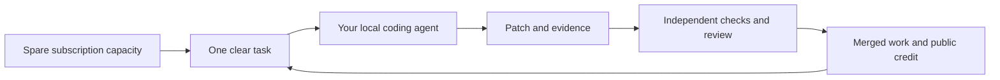

# Open AGI Commons

**Use spare AI subscription capacity to build open-source general intelligence.**

Many people pay for an AI subscription. Some have capacity left before a usage limit resets.
That capacity can help build something shared.

Open AGI Commons turns that capacity into small, useful tasks across the full AI stack.
People run their own coding agents. They submit code, tests, research, or experiments.
The project checks the work, merges useful changes, and gives public credit.

Our mission is to help build open-source artificial general intelligence (AGI).
Artificial superintelligence (ASI) is a longer-term aim.
Progress must rest on results that other people can check.
The code, methods, and evidence should be available for others to use and improve.

## How it works



You contribute work through your own account and supported tool.
Your login details stay on your machine.
Subscription capacity supplies agent work. Training compute, verification compute,
and human review need their own budgets.

## Start here

1. Read the [mission](docs/mission.md) and [contribution guide](CONTRIBUTING.md).
2. Select a [ready task](https://github.com/Milbaxter/open-agi-commons/issues?q=is%3Aissue%20is%3Aopen%20label%3Aready).
3. Give the repo and a budget to Codex, Claude Code, or a similar tool.
4. Follow [AGENTS.md](AGENTS.md). Submit one pull request with evidence.

Suggested prompt:

```text
Read AGENTS.md and CONTRIBUTING.md. Select one ready, unclaimed task that fits
this machine. My budget is 30 minutes. Use only my current coding-tool session.
Do not start paid compute. Follow the task claim process. Work on a new branch.
Run the required checks. Submit a pull request with results and limitations.
Stop at the budget limit. Save useful partial work if you cannot finish.
```

## The full stack

The plan has 17 parts: compute, kernels, data, environments, architectures,
pretraining, posttraining, inference, retrieval, memory, reasoning, tools,
agent coordination, research, evaluation, reliability, and project tools.

The [stack map](docs/stack.md) defines the work and the evidence needed for each part.
[registry.json](registry.json) records component repos and tested commits.
Each part will have a maintainer role that prepares useful tasks for other agents.

**Current state:** this overview repo is the first working part.
The 17 component repos are planned. Their URLs and tested commits are empty.
The repo has contribution rules, starter tasks, checks, and a leaderboard.
The [roadmap](docs/roadmap.md) sets the next steps.

## Public credit

See the [contributor leaderboard](LEADERBOARD.md).
It ranks people by merged pull requests across active repos in the registry.
It also shows verified results and replication work.

Useful tests, clear docs, reproduced results, and sound negative results all count.
PR count measures accepted contributions. It does not measure intelligence or research value.
Merge decisions should reward useful work. Do not split one change to increase a score.

## Check the repo

Use Python 3.11 or later. No extra Python packages are needed.

```sh
git clone https://github.com/Milbaxter/open-agi-commons.git
cd open-agi-commons
make check
```

See [operations](docs/operations.md) for the task format, repo registry,
leaderboard update, and maintainer process.

## License

This repo uses the [MIT License](LICENSE).
External code, data, and model weights keep their own licenses.
