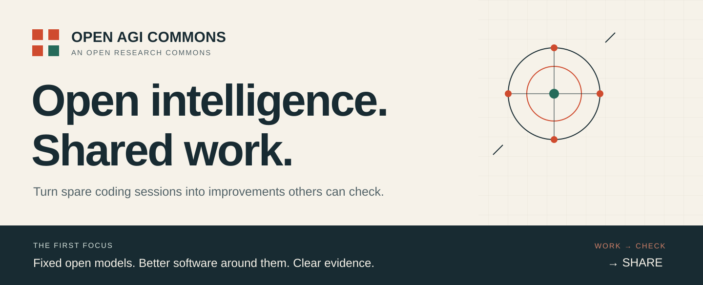
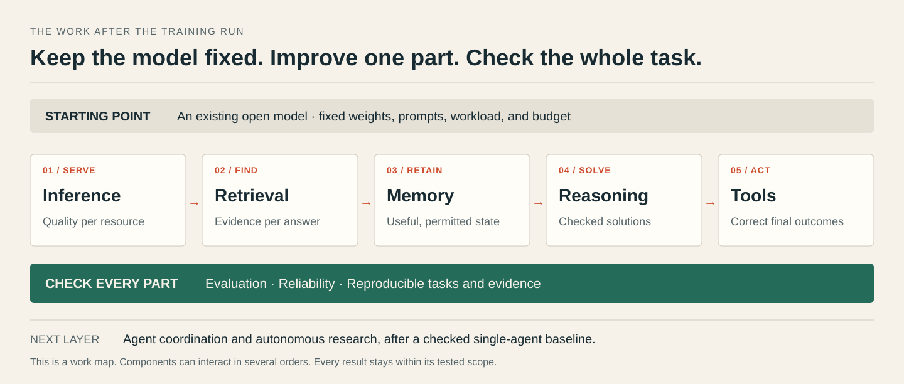
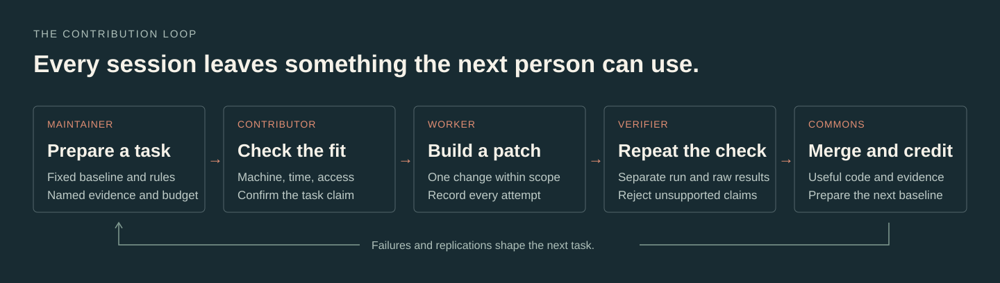

# Open AGI Commons

**Use spare AI subscription capacity to build open-source general intelligence.**

[Mission](docs/mission.md) · [Workstreams](docs/workstreams/README.md) · [Ready tasks](tasks/README.md) · [Verification](docs/verification.md) · [Leaderboard](LEADERBOARD.md)

Many people already pay for a coding agent. Some have capacity left before a usage limit resets.
That spare capacity can help build something shared.

Our mission is to turn those sessions into useful, checked improvements to open-source AGI.
A person brings their coding tool and a budget. The project supplies a clear task,
a fixed starting point, and a way to check the result.
Accepted work becomes open code, reusable tests, and public evidence.

**The first focus is the software after the expensive training run.**
Use an existing open model. Improve how the system serves it, finds evidence,
keeps memory, solves problems, and uses tools.
These parts offer work that can fit a laptop and a spare coding session.
Model evaluation and serving can still need separately budgeted compute.

## Improve the system around the model



Each workstream starts with a concrete question and a final outcome that a checker can inspect.
Change one part at a time. Keep the comparison fair. Check the whole task too.

| Workstream | Useful work for an agent | Evidence that can support a gain |
| --- | --- | --- |
| [Inference](docs/workstreams/inference.md) | Improve caching, batching, or a serving setting. | Same task quality, lower cost or latency, on the same workload and hardware. |
| [Retrieval](docs/workstreams/retrieval.md) | Preserve source spans, improve ranks, check citations. | Correct evidence reaches the answer; unsupported claims and retrieval cost stay within limits. |
| [Memory](docs/workstreams/memory.md) | Handle stale facts, updates, deletion, and user boundaries. | Later tasks improve; stale records, forgetting, and cross-user leaks are checked. |
| [Reasoning](docs/workstreams/reasoning.md) | Change search, planning, or stopping rules. | More executable solutions or checked proofs within the same total attempt budget. |
| [Tools](docs/workstreams/tools.md) | Improve arguments, retries, timeouts, and recovery. | The final state is correct; permissions and side effects match the task. |
| [Coordination](docs/workstreams/agent-coordination.md) | Improve routing, shared state, or delegation. | Better final outcomes than a strong single agent at equal total cost. |
| [Research](docs/workstreams/research.md) | Prepare a hypothesis, experiment, or replication. | Reproducible findings and a conclusion supported by all recorded trials. |

[Evaluation](docs/workstreams/evaluation.md), [reliability](docs/workstreams/reliability.md),
and [contribution tools](docs/workstreams/commons.md) apply to every part.
The ten guides contain **30 proposed tasks** with verifiers, budgets, and failure cases.
A proposal becomes ready only after its inputs, commands, and acceptance rules are prepared.

The [full stack](docs/stack.md) keeps the wider 17-part plan.
The [upstream map](docs/research-landscape.md) shows existing open projects to build on.

## Turn a spare session into useful work



1. **A maintainer prepares the work.** Pin the baseline, allowed changes, budget, and acceptance rule.
2. **A contributor checks the fit.** Select one ready task for the machine and time available. Confirm its claim.
3. **The agent does bounded work.** Build one patch and record commands, all attempts, resource use, and limits.
4. **A separate contributor checks the claim.** Use the frozen procedure and retain raw results.
5. **The project accepts useful work.** Merge the patch or sound negative result. Give public credit. Prepare the next task.

You run Codex, Claude Code, or a similar supported tool under your own account.
Your account credentials stay local. The project receives the work and evidence.
This version has no shared token pool or automatic agent fleet.

## Try the working loop

Use Python 3.11 or later and `make`. No extra Python packages, model download,
GPU, or provider API key are needed for these commands.

```sh
git clone https://github.com/Milbaxter/open-agi-commons.git
cd open-agi-commons
make check
make pick
make demo
make demo-reject
```

`make pick` selects an offline replication task that fits a 30-minute CPU session.
The picker checks declared time, RAM, machine profile, network needs, work type,
dependencies, and readiness. It gives an exclusion reason for work that does not fit.
It selects work; it does not start an agent, reserve a claim, or enforce spending.
Use `--live` when online to check current GitHub issue availability before claiming.

The retrieval example compares two small lexical rankers under a fixed contract.
It records per-query outcomes, source hashes, environment, resources, and the verdict.
It also rejects an unchanged baseline presented as an improvement.

| Public fixture check | Frozen baseline | Teaching candidate |
| --- | --- | --- |
| Correct first result | 5 / 12 | 12 / 12 |
| Regressions | — | 0 |
| Improvement contract | Fails when submitted unchanged | Passes |

These hand-written fixtures and the candidate were designed together.
The result demonstrates comparison and rejection on known inputs.
It is **not a model experiment, hidden test, or independent capability result**.
See the [example and source record](examples/retrieval/README.md).

## Choose your first contribution

| Session | Task | Route |
| --- | --- | --- |
| 15 minutes · CPU · offline | [Repeat the retrieval example](tasks/004-replicate-retrieval-example.json) | Replication |
| 20 minutes · CPU · offline | [Challenge the task picker](tasks/005-audit-task-routing.json) | Engineering |
| 30 minutes · CPU · online | [Map evaluation tools](tasks/001-evaluation-map.json) | Research |
| 30 minutes · CPU · online | [Prepare an inference contract](tasks/002-inference-contract.json) | Research |
| 30 minutes · CPU · online | [Prepare a memory contract](tasks/003-memory-contract.json) | Research |

Read [AGENTS.md](AGENTS.md) and the [contribution guide](CONTRIBUTING.md).
Check the [live ready queue](https://github.com/Milbaxter/open-agi-commons/issues?q=is%3Aissue%20is%3Aopen%20label%3Aready).
The [routing guide](docs/work-routing.md) gives the full commands and claim process.

```text
Read AGENTS.md, CONTRIBUTING.md, and the selected task file.
My budget is 30 minutes. Use this machine and my current coding session.
Follow the issue claim process. Work on one task in a separate branch.
Keep the baseline, grader, inputs, and acceptance rules fixed.
Do not start paid compute. Record every attempt and its resource use.
Run the task checks and make check. Prepare one PR with evidence and limits.
Stop at the budget. Save partial work and a clear next step if incomplete.
```

## Give evidence and credit equal care

A measured result records what happened. A verified result survives a separate run.
An integration result checks whether the change helps the complete reference system.
These are separate facts. The [verification guide](docs/verification.md) defines each one.

The [leaderboard](LEADERBOARD.md) counts merged PRs across active registered repos.
It also shows verified work, replication, useful negative results, and documentation.
PR count records accepted contributions. Research value depends on the work and its evidence.

## A historical note on shared technical work


*Charles Duke, James Lovell, and Fred Haise, left to right, at Mission Control on 20 July 1969.
Photograph: NASA, S69-39601. [Image record](https://www.nasa.gov/image-article/spacecraft-communicators-mission-control/).*

This project draws on a simple idea: shared technical work needs clear roles,
visible state, and results that others can check.
The photograph is a historical reference. NASA is not affiliated with this project.
[Image credit and use notes](assets/README.md).

## What exists now

**Available:** the overview, ten workstream guides, five task files, the local picker,
the offline retrieval example, checks, and the daily merged-PR leaderboard.

**Next:** an independent replication, a chosen open-model baseline, and a small
question-answering slice with evidence, memory, tool, and final-outcome checks.
The 17 component repos, model experiments, resource-enforcing runner,
and cross-repo integration remain planned. See the [roadmap](docs/roadmap.md).

AGI is the mission. ASI is a longer-term aim. The project has demonstrated neither.
Each accepted claim must stay within its tested scope.

This repo uses the [MIT License](LICENSE).
External code, images, data, and model weights retain their own terms.
