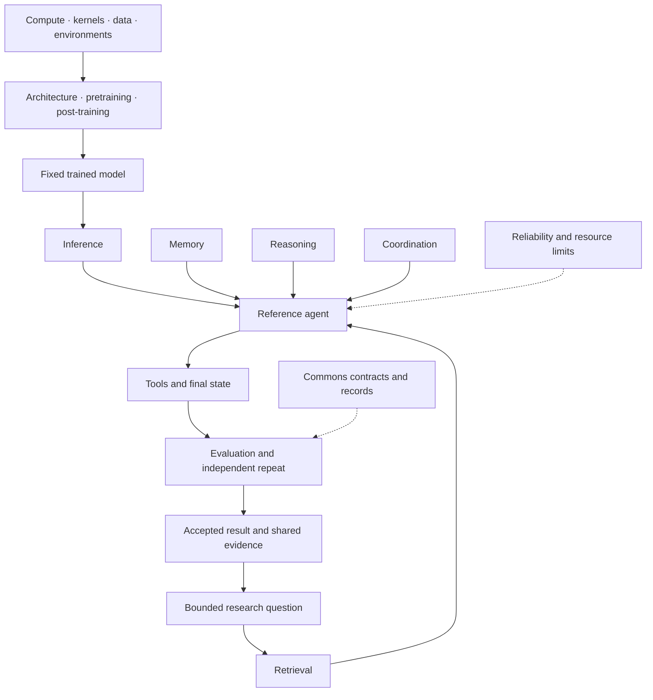

# The stack · from trained model to checked work

**Our first focus is the system after the expensive training run.**

The mission still covers the full open AI stack.
Hardware, data, and training matter. Their experiments often need large shared budgets.
People with spare coding-tool capacity can start elsewhere.
They can improve evidence access, state, plans, actions, and the checks around a fixed model.

The table keeps all 17 parts in view.
Each component repo is planned until [registry.json](../registry.json) marks it active.
Workstream guides describe proposed work. They do not report model experiments.

## The foundation

| Part | Scope | Required evidence |
| --- | --- | --- |
| `compute` · Hardware and distributed compute | Scheduling, hardware use, storage, fault recovery. | The same checked workload uses less time, cost, or energy. Include retries and failures. |
| `kernels` · Compilers and numerical software | Kernels, compilers, memory layout, numerical precision. | Reference correctness tests pass. Measure real workloads on named hardware. |
| `data` · Training data | Collection, cleaning, labels, coverage, data origins. | Unseen-task gains at equal training compute. Check rights and contamination. |
| `environments` · Environments and curricula | Simulators, task generators, learning order, rewards. | Detect reward exploits. Show transfer to independently prepared tasks. |
| `architectures` · Model structures | Attention, recurrence, experts, representations, world models. | Compare capability at equal training and inference budgets. Name tested sizes. |
| `pretraining` · Pretraining and optimization | Objectives, optimizers, schedules, training stability. | Reach fixed capability with fewer resources. Include failed and repeated runs. |
| `posttraining` · Post-training | Instruction tuning, feedback, reinforcement learning, reward models. | Gains on independent tasks with evaluation separate from the training reward. |

Post-training remains part of the training foundation here.
Small adapter studies can fit later, with their own fixed training budget.
The first downstream work keeps weights fixed to reduce experimental cost and uncertainty.

## The first contribution surface

| Part | What an agent can improve | What a verifier must check |
| --- | --- | --- |
| [Inference](workstreams/inference.md) | Caching, serving, quantization, routing, bounded retries. | Correct work per total budget, quality, peak memory, and slow requests. |
| [Retrieval](workstreams/retrieval.md) | Parsing, search, ranking, source spans, citations. | Retrieved evidence and supported final answers, scored separately. |
| [Memory](workstreams/memory.md) | Writes, recall, corrections, access, deletion. | Sequence outcomes, stale facts, false writes, and retained data. |
| [Reasoning](workstreams/reasoning.md) | Plans, search, programs, proofs. | Executable solutions or proofs. Count every attempt. |
| [Tools](workstreams/tools.md) | Adapters, browser actions, call validation, recovery. | Final state, permissions, and side effects in resettable environments. |
| [Agent coordination](workstreams/agent-coordination.md) | Routing, handovers, shared state, cooperation. | A gain over a strong single agent at equal total resources. |
| [Research](workstreams/research.md) | Hypotheses, experiments, replication, analysis. | Reproducible findings per complete resource budget. |
| [Evaluation](workstreams/evaluation.md) | Tasks, graders, splits, statistics, contamination checks. | Known failures are rejected. Independent repeats support the decision. |
| [Reliability](workstreams/reliability.md) | Injection resistance, permissions, constraints, recovery. | Fewer named failures with useful capability retained. |
| [Commons](workstreams/commons.md) | Contracts, manifests, review tools, credit. | Another worker can repeat the work and inspect the evidence. |

## How the parts connect

Keep interfaces small: request, evidence span, memory record, action,
final outcome, and resource event.
Each component test checks its own interface.
A full-slice test checks whether the change improves useful work.
Keep model quality, component quality, and integration quality as separate claims.

## What to build first

1. Prepare a fixed document set, answer tasks, and a simple reference agent.
2. Make the verifier reject missing evidence and wrong final answers.
3. Add a complete resource ledger and enforced stop conditions.
4. Improve retrieval or memory one change at a time.
5. Repeat a promising result independently. Then test it in the full slice.
6. Add coordination and research loops after the single-agent checks work.

This is a proposed order. No new runtime component is active merely because it has a guide.
The [workstream index](workstreams/README.md) gives the task-ready gate and evidence levels.
The [maintainer role](../roles/component-maintainer.md) gives the queue process.
