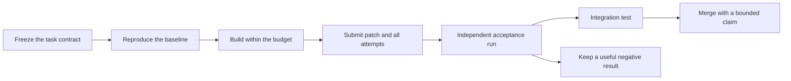

# Make each claim checkable

**An agent submits a change. Evidence decides what we can say about it.**

The project can direct spare agent time to retrieval, memory, planning, tools,
and other parts of the stack. Each task must have a small, clear outcome.
Each claim must have a fixed test and a record that another person can use.

Use the [task contract](../templates/task.json), [result record](../templates/result.md),
and [work routing guide](work-routing.md) together.

## The path from work to evidence

The author can run public tests throughout development.
The author must not control the final acceptance decision.
For model experiments, a separate verifier runs the fixed procedure.
A green CI job can check files and deterministic behavior.
It cannot by itself establish independent evidence of a model improvement.

## Say what kind of result this is

Evidence state applies to a claim. Merge state applies to a PR.
A useful PR can merge before a capability claim has independent evidence.

| Evidence state | What supports it | What can be said |
| --- | --- | --- |
| **Hypothesis** | A reason to try the change. | “This may reduce false memory.” |
| **Measured result** | The author's recorded run under a fixed contract. | “This result occurred on this task set and machine.” |
| **Verified result** | A separate verifier confirms the claim under the same contract. | “A separate run confirmed this bounded result.” |

Add `integration: passed`, `failed`, `pending`, or `not applicable` separately.
A component can have a verified result and still fail in the reference agent.
If later evidence contradicts a result, mark it disputed and link the new record.
Keep the original record. Update the public claim and the review label.

The offline retrieval example in this repo is a **deterministic fixture demonstration**.
Its checker confirms the declared outcome on small, public, fixed inputs.
It does not run a model. It does not use hidden acceptance data.
It does not establish an independent run or general retrieval capability.
Its machine-readable states are `fixture-measured` and `fixture-rejected`.
Treat its output as evidence about the fixture and checker only.

## Freeze the improvement contract before work

The task file holds routing fields and review criteria.
Runnable tasks can also link a contract, baseline artifact hashes,
a verification command, an expected state, and a requirement for independent review.
The overview's checks validate those fields. They do not run an independent experiment.

For a model experiment, attach a full contract with the fields below.
These are review requirements for future experiments.
The current task JSON does not enforce every field in this table.

| Contract part | Record before the run |
| --- | --- |
| Question | One testable claim. Name the module and the user outcome. |
| Scope | Allowed files and behavior. Name the interfaces that must stay compatible. |
| Baseline | Exact code commit, model revision, configuration, and reproduction command. |
| Inputs | Data release, split, license, source, and SHA-256 hashes. Include tool and environment state. |
| Grader | Code commit or file hashes. Pin prompts and model revision if a model is part of the grader. |
| Primary metric | One metric, its unit, direction, minimum gain, and pass rule. |
| Regressions | Limits for quality, latency, memory, cost, and relevant failure rates. |
| Budget | Wall time, machine, model calls or tokens, tool calls, attempts, and human help. |
| Comparison | Equal budgets, or the exact budget difference that the claim tests. |
| Repeats | Task count, seeds, run order, uncertainty method, and required repeat count. |
| Acceptance access | Development set, acceptance set owner, release plan, and permitted submissions. |
| Verifier | Named reviewer or open verifier request, machine needs, and verification budget. |
| Integration | Reference agent commit, regression set, compatibility checks, and rollback plan. |
| Stop rules | Budget reached, baseline failure, invalid inputs, or acceptance data exposure. |

“Faster” is incomplete. Use a claim such as:
“Reduce p95 latency on workload W by the fixed threshold, on machine H,
with no loss beyond the quality limit, within budget B.”
The workload, threshold, limits, and budget must be fixed before the run.
Examples describe contract shape. They are not measured gains.

### Prove that the baseline runs

Run the baseline before editing the candidate.
Save its command, output, environment, and artifact hashes.
Record CPU or GPU model, available RAM, operating system, runtime,
dependency versions, driver versions where relevant, and network needs.

A commit pins code. A hash pins an input file.
Neither proves that the test is fair or that its labels are correct.
Review the test design and inspect sample cases too.
If a hosted model has no immutable revision, record its name and run time.
State that exact model reproduction is unavailable.
Do not publish a precise reproducibility claim that the provider cannot support.

If the baseline fails, stop the experiment.
Submit a reproduction defect or a corrected setup as a separate task.
Do not compare the candidate with a broken baseline.

## Keep development and acceptance separate

**Development tests** are public. Agents use them to debug and compare ideas.
**Acceptance tests** check the submitted candidate after its code is frozen.
For capability experiments, use fresh or held-out tasks where feasible.

The verifier controls acceptance access and logs each submission.
Record the acceptance-set hash before testing the frozen candidate.
Publish data and raw outcomes after the decision when rights permit.
Then retire that set from future unseen-task claims.
Keep future acceptance cases separate from the released evidence.

An unseen set must also be outside retrieval indexes, memory stores,
prompt examples, and development logs. Model training exposure may be unknown.
Record that uncertainty. New task construction alone does not prove no contamination.
Benchmark exposure can inflate reported performance, so its limits belong next to the claim.
See [Sainz et al., on benchmark contamination](https://arxiv.org/abs/2310.18018).

For fully public tests, say “public regression suite.”
They can establish a useful software fix. They support a narrower capability claim.
Do not call a public fixture held out because a script reads it in a second step.

### Freeze and test the grader

Review the grader before work starts.
It must accept known good results and reject known bad results.
Include empty output, malformed output, a wrong answer with a valid citation,
and a high score that violates the task's required outcome.

Keep the grader outside the candidate's allowed change scope.
Run trusted grader code against candidate outputs in a bounded environment.
Do not run an untrusted candidate with acceptance secrets or broad credentials.
Limit filesystem, network, tool permissions, and execution time to the contract.
For tool tasks, test the final environment state as well as the transcript.

A grader repair needs a separate review.
Give the contract a new version and rerun the baseline and candidate.
An agent must not lower a threshold to approve its own result.

## Count the whole search

A result record includes every candidate, failed attempt, retry, and timeout.
Count development, final evaluation, independent verification, and human review separately.
Unknown usage stays unknown. Label estimates and explain their basis.

The contract sets the candidate limit and acceptance submission limit.
The author selects a candidate using development results, then freezes it.
The verifier applies the declared acceptance procedure once per allowed submission.
If acceptance feedback guides a new candidate, record that exposure.
Use fresh acceptance data or a reviewed method for adaptive testing.
Do not present a tuned winner as an untouched first submission.

Repeated use of holdout scores can cause overfitting to that holdout.
This is why fresh confirmation and a full attempt log matter.
See [Dwork et al., on adaptive analysis and holdout reuse](https://proceedings.neurips.cc/paper/5993-generalization-in-adaptive-data-analysis-and-holdout-reuse.pdf).
This project does not implement that paper's reusable-holdout algorithm.

For stochastic experiments, fix the statistical plan before testing.
Use paired task results where the comparison allows it.
Report all planned repeats, task count, aggregate results, and uncertainty.
State the confidence level and calculation method.
Separate variation across seeds from variation across tasks.
Account for multiple tested claims if acceptance relies on statistical significance.
Choose sample size for the effect and variability expected in that task.
There is no universal “three runs means verified” rule.

A deterministic fixture needs an exact expected result and error checks.
Repeating the same fixed input does not create new evidence about general capability.

## Give verification its own task and budget

The verifier starts from a clean checkout of the frozen candidate.
They check the contract and hashes, reproduce the baseline, and run acceptance.
They report their own identity, environment, commands, raw outputs, and verdict.
They also report author help and any conflict of interest.

A second agent in the author's session can help with local review.
That review is not independent verification.
A verifier can use an agent, but a separate person must control the run and verdict.
The author cannot provide the only raw outputs and call them independently confirmed.
If no verifier is available, keep the result measured and publish a verification request.

Use separate findings for each part of the decision:

- Contract and baseline match: yes or no.
- Fixed primary rule passes: yes or no, with measured values.
- Regression limits pass: yes or no, with failures listed.
- Budget limits pass: yes or no, with total resources.
- Verification agrees with the claim: yes, no, or inconclusive.

Artifact availability and independent result confirmation are separate checks.
[ACM SIGIR's artifact guidance](https://sigir.org/general-information/acm-sigir-artifact-badging/)
also treats them separately and records reviewer work.
The Commons labels are local project labels, not ACM certification.

## Check the complete agent before promotion

A retrieval change can help retrieval scores but hurt answer quality.
A memory change can help recall but retain false information.
A planner can solve more tasks by using far more calls.
The integration test must catch these effects.

Run the old and new reference agent at the same end-to-end budget.
Pin every component and use the fixed regression set.
Measure final outcomes, required constraints, recovery, and total resources.
Record the integration commit and rollback path.
Promote the candidate only when both the component rule and integration gates pass.

Until a reference agent exists, report integration as pending or not applicable,
with a reason. Do not invent an integration result.

## Keep useful failures

A sound negative result can stop many agents from repeating the same dead end.
Publish the fixed question, all attempts, failure cases, and limits.
“No gain under this budget on this set” is useful.
“This method can never work” usually exceeds the evidence.

A maintainer can merge a negative result, replication, test repair, or research map.
Use the [contribution rules](../CONTRIBUTING.md) for labels and public credit.
Passing one test does not establish AGI or ASI.
Every claim stays within its tested task set, scale, budget, and environment.
