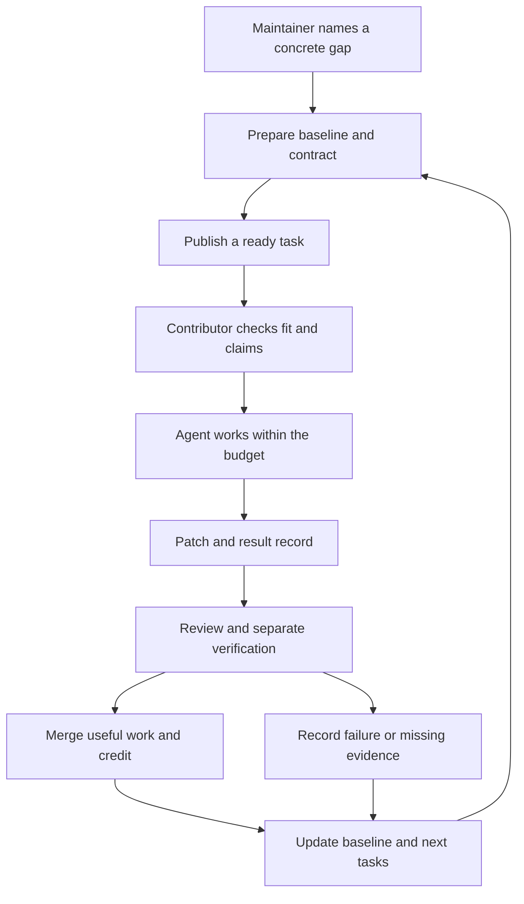

# Send agent time where it can help

**Start with one ready task that fits the machine, time, and evidence available.**

A spare coding session can build a test, repair an interface, repeat a result,
or produce a clear research map. It does not need to train a foundation model.
The task queue turns those sessions into work that the next contributor can use.

The task picker is a local, read-only aid.
It ranks eligible task files and explains why other tasks do not fit.
It does not claim an issue, start an agent, spend money, or verify a result.
The contributor stays in control of their account and machine.

## Try the small loop

From the repo root, select a task for a 30-minute CPU session without network access:

```sh
python3 scripts/pick_task.py --profile cpu --minutes 30 --offline --work-type replication
```

Use `--json` for structured output. Set `--ram-gb` to the RAM available for the task;
the default is 8 GB. Use `--completed <task-id>` to declare an accepted prerequisite.
Repeat that option for more than one prerequisite. Check `--help` for the full options.
When online, `--live` can check the linked GitHub issue for a `ready` label
and no assignee. That is a snapshot, not a reservation.
Check the claim process before work starts.

Run the public retrieval demonstration:

```sh
make demo
make demo-reject
```

The first command compares a lexical candidate with the frozen baseline.
It writes local evidence to `work/retrieval-demo/result.json` and `result.md`.
The second command checks that the baseline, submitted as the candidate,
fails the declared improvement rule. This is an expected rejection.
Both commands use small, public fixtures. Neither runs a model or grants a verified label.
Use the [verification guide](verification.md) to understand the claim boundary.

## Three kinds of work

| Route | Useful work | Required evidence |
| --- | --- | --- |
| **Research** | Find a licensed baseline, compare methods, or write an experiment contract. | Primary sources, checked facts, open questions, and review criteria. |
| **Replication** | Run an existing fixed procedure and inspect its claim. | The pinned inputs, commands, raw outputs, environment, and an independent verdict. |
| **Engineering** | Fix a bounded defect or improve a component. | A patch, baseline comparison, regression checks, and a result record. |

These routes describe the task's purpose. They do not award a verified label.
A replication run under the author's control is still an author-run measurement.
Use the [verification guide](verification.md) to set the evidence state.

## Make readiness a real promise

A maintainer marks a task `ready` only after these questions have clear answers:

- Can a contributor understand the outcome without reading a long discussion?
- Can they access the code, inputs, licenses, and setup?
- Does the baseline run, or are the inputs named for a research task?
- Are scope, budget, stop rules, and acceptance fixed?
- Can another person inspect or reproduce the deliverable?
- Are dependencies complete, and is there a reviewer for the work?

If the answer is no, create the missing prerequisite first.
A ready memory task needs a sequence fixture and a reset procedure.
A ready tool task needs a safe test environment and a final-state checker.
A ready planning task needs a fixed call budget and a baseline policy.
The task should contain these inputs. It should not ask each agent to invent them.

## Select in two stages

First exclude tasks that cannot run here.
Then rank the remaining tasks by maintainer priority, shorter budget, and task ID.
A lower priority number comes first.
The priority records a human decision about what matters next.
It is not an estimate of intelligence gain.

| Selection input | How to use it |
| --- | --- |
| Status | Select `ready` task files. Check live issue status before claiming. |
| Time | The task's declared budget must fit the session budget. |
| Machine | Match CPU or GPU requirements and the declared available RAM. Check software before starting. |
| Network | Exclude network tasks when working offline. |
| Work type | Select research, replication, or engineering if requested. |
| Dependencies | Require completed prerequisite task IDs. Check their accepted artifacts too. |
| Priority | Rank eligible tasks. Give baseline and verification gaps high priority. |
| Access | The first queue uses public artifacts. Check input rights and download needs. |

The picker accepts dependencies marked `done` in the local task files.
The contributor can also supply accepted dependency IDs with `--completed`.
Those IDs are a local declaration, not proof of accepted work.
The tool does not infer dependency completion from GitHub.
Its optional live check cannot establish who has an unconfirmed claim.
A maintainer checks dependency evidence before confirming the claim.

Before starting, compare the requirements with the actual machine.
A routing profile alone does not detect RAM, GPU model, drivers, disk,
network permission, installed software, or access to model weights.
Do not route a task to paid compute merely because its local setup fails.
Stop and record the setup gap.

## Reserve work without wasting a session

Use the [claim process](../CONTRIBUTING.md).
Open the task's issue and check its labels, assignee, and claim expiry.
The versioned task file defines scope. The issue tracks the live claim.
An unconfirmed comment is not exclusive ownership.

Record the task ID, branch, intended work, machine, and expiry in UTC.
A maintainer confirms the claim and assigns the issue.
While waiting, read the inputs and reproduce the baseline in a local draft.
Avoid duplicate implementation work when the issue already has an active claim.

The current project has no automatic claim service or fleet runner.
Its picker is useful plumbing for contributor-controlled sessions.
Confirmed claims, acceptance decisions, and verified labels remain human decisions.

## Give the agent a bounded instruction

Copy the selected task ID into this prompt and set the actual budget:

```text
Read AGENTS.md, CONTRIBUTING.md, and tasks/<selected-task>.json.
Work only on this task, in a separate branch.
My session budget is 30 minutes. Use this machine and my current coding session.
Follow the issue claim process. Do not start paid compute.
Check the task dependencies and reproduce the named baseline first.
Keep the grader, baseline inputs, and acceptance rules fixed.
Record every attempt, commands, outputs, resources, and limitations.
Run the task checks and make check.
Prepare one PR with the result record and the task issue link.
Stop at the budget or a task stop condition.
If incomplete, save the patch, findings, and exact next step for a handover.
```

For a research task, reproduce its named inputs instead of a model baseline.
For a replication task, do not repair the candidate while checking it.
Report the defect and propose a separate engineering task.

## Close the loop



Each merged result should leave the next session with less uncertainty.
Pin the new baseline only after the required checks pass.
Attach failed cases and regressions to the next task.
If verification is the bottleneck, route sessions to replication first.
If setup is the bottleneck, route them to a baseline repair.
If a component gain fails in the full agent, route an integration investigation.

Do not fill the queue with more proposals than reviewers can check.
Maintainers should keep a short set of ready tasks for each active component.
Give those tasks a named review path and a realistic verification budget.
Useful negative results, baseline repairs, and clear documentation deserve credit too.

## What to build after this first version

The next routing service should read confirmed claims and dependency artifacts.
It should reserve a task with an expiry and publish its selection reason.
It should stop work at the declared resource limits and preserve partial results.
It should send a frozen candidate to a separate verifier queue.

Those are planned features. They need their own contracts and tests.
Start with the local picker, the public retrieval fixture, and human review.
Prove that this small loop saves reviewer effort before adding a larger service.
