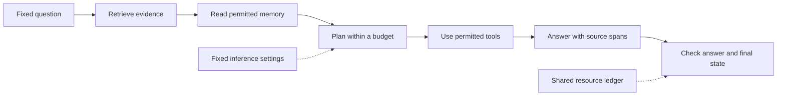

# Work after the training run

**Keep the model fixed. Improve the system around it. Prove the change.**

A trained model is a starting point.
Useful work also needs fast inference, good evidence, durable memory,
correct plans, controlled tools, and checks that can reject bad results.
These parts offer work that people can divide into small tasks.
Many first tasks need a CPU and a coding-tool session.
Runtime claims can still need model calls, a GPU, and an independent verifier.

These guides define the work. They do not report completed experiments.
All component repos remain planned until the [registry](../../registry.json) says otherwise.
The three task ideas in each guide are **proposals**, not ready assignments.
Use the [ready issue queue](https://github.com/Milbaxter/open-agi-commons/issues?q=is%3Aissue%20is%3Aopen%20label%3Aready)
for work that a maintainer has prepared.

## Choose a part

| Part | Question to answer | First useful artifact |
| --- | --- | --- |
| [Inference](inference.md) | Can the same model deliver correct work with fewer resources? | A trace replay and cost ledger. |
| [Retrieval](retrieval.md) | Can an answer use the right evidence? | A corpus snapshot and checked citations. |
| [Memory](memory.md) | Can the system keep useful facts and remove stale ones? | A sequence test with source and deletion checks. |
| [Reasoning](reasoning.md) | Can a plan produce a result that an executor accepts? | A search budget and independent result checker. |
| [Tools](tools.md) | Can an action reach the right state within its permissions? | A sandbox with final-state checks. |
| [Agent coordination](agent-coordination.md) | Does delegation beat a strong single agent at equal cost? | A task graph and shared resource ledger. |
| [Research](research.md) | Can a research loop produce a reproducible finding? | A fixed question and one repeatable experiment. |
| [Evaluation](evaluation.md) | Can the checker detect real failure? | Known good and bad cases. |
| [Reliability](reliability.md) | Can the system resist known failures and remain useful? | Paired normal and fault tests. |
| [Commons](commons.md) | Can another person pick up and verify the work? | A complete task and evidence package. |

## Build one vertical slice

Start with one local task: answer a question from a fixed document set.
The same trained model must serve both the baseline and the candidate.

First, make the baseline run.
Next, make the verifier reject deliberately bad answers.
Then change one component.
Re-run the component check and the full slice.
A faster retriever has limited value if it makes final answers worse.
A better planner has limited value if it hides extra attempts.

The overview has a [public retrieval fixture](../work-routing.md#try-the-small-loop).
It demonstrates comparison and rejection on small CPU inputs.
It does not run a model. The model-assisted slice above remains proposed.

Add coordination only after a single agent has a checked baseline.
Add autonomous research only after the experiment runner has enforced limits.
This sequence reduces the number of unknown parts in each result.

## Turn a proposal into a ready task

A maintainer must prepare these items before dispatch:

1. **One question.** Name the defect or hypothesis. State what a result would change.
2. **One fixed starting point.** Pin code, model, tokenizer, prompts, data, and configuration.
3. **One bounded patch.** List allowed files and interfaces. Keep the verifier outside that scope.
4. **One executable check.** Give exact setup and run commands. Check final outcomes.
5. **One budget.** Limit worker time, CPU time, model calls, tokens, retries, disk, and paid cost as needed.
6. **One acceptance rule.** Fix the gain, regression limits, repetitions, and decision method in advance.
7. **One independent verifier.** Name the person or worker that can repeat the test.
8. **One result package.** Save all trials, raw outputs, hashes, resource totals, and limits.

Do a clean setup and baseline run before adding `ready` to an experiment task.
For a source review or contract task, fix the source inputs and manual review criteria instead.
Do not require a model run for work that makes no model claim.
If the setup does not fit the declared machine and budget, keep the task blocked.
Do not let the worker repair the acceptance rule while testing its own patch.

## Use the right claim

| Evidence level | What it supports | What it cannot support alone |
| --- | --- | --- |
| Fixture check | Parser, state machine, budget, or grader behavior on known cases. | A model capability gain. |
| Fixed-model experiment | A measured change on the named workload and machine. | A gain across other models, domains, or sizes. |
| Independent repeat | The stated result survives a clean repeat under the fixed contract. | A claim of AGI or production readiness. |
| Integration test | The change helps the reference system within its test scope. | General deployment safety or reliability. |

Write the claim at the level of the evidence.
The [verification guide](../verification.md) defines the full method.
The [maintainer role](../../roles/component-maintainer.md) defines who prepares the queue.
